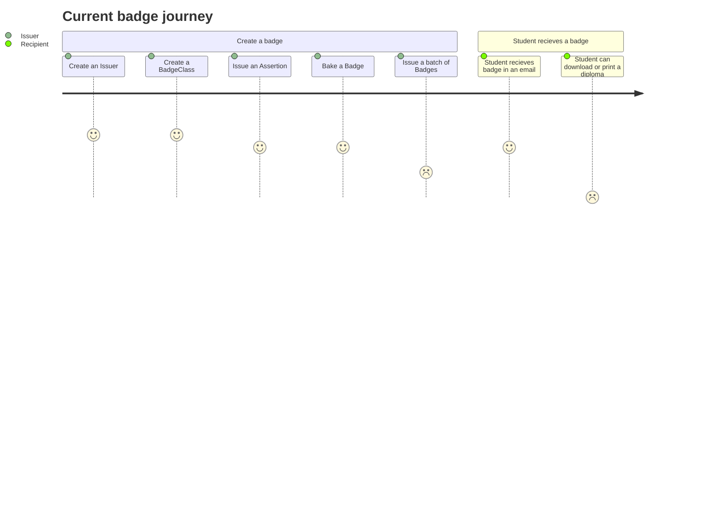
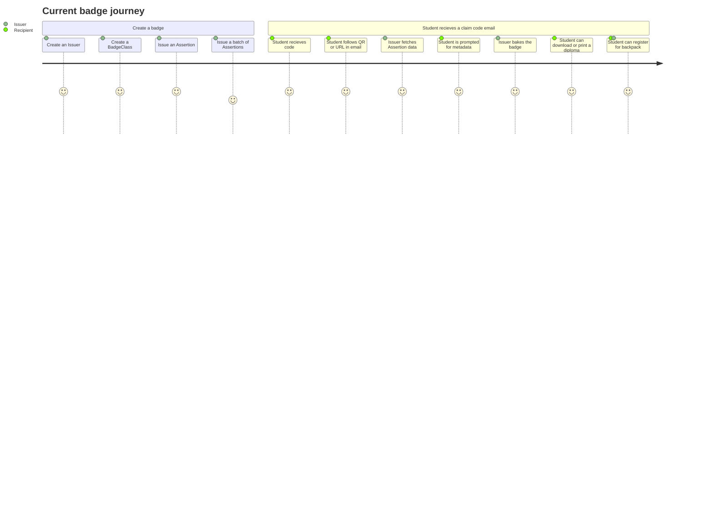
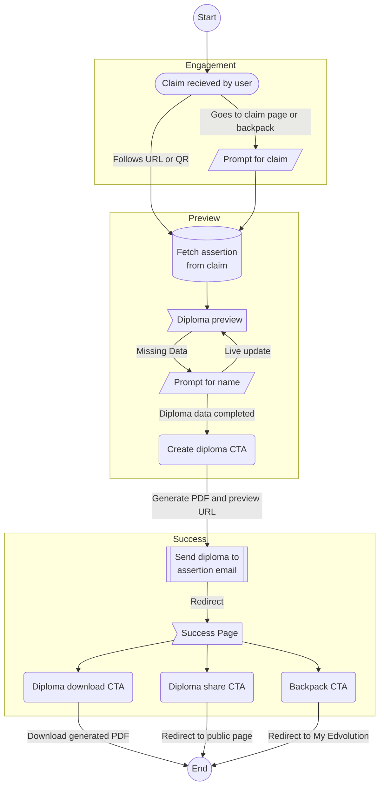

## Table of Contents
```toc
from-heading: 2
```

## Badge Journeys
> Badge issuing and recipient journeys for Badgetree and My Edvolution

### Current Journey



The current flow has at least two participants, an **Issuer** and a **Recipient**. In order to reduce the work needed for this feature, we can use Badgetree for the first part of the journey.

With it, we can emit **Issuers**, **BadgeClass** and **Assertions**. The current limitations are as follow:

#### Issuer Limitations

- We don't save the name used when emitting assertions, so we can't recall that information for the diploma.

- Assertions are immediately baked, which requires network and file operations regardless of whether the user claims the badge or not.

- Batch assertions run sequentially because they rely on network and file operations.

#### Recipient Limitations

- The badge can't be inlined because email servers strip metadata.

- There is no public page that hosts the accomplishment or diploma.

- There is no diploma or physical representation of the badge that can be printed out to be used outside of digital contexts.

### Proposed Journey



#### Proposed Issuer Improvements

- The name is no longer required, only the recipient email.

- Assertions are not immediately baked, which improves batch processing time.

- Batch assertions can be easily parallelized for further performance improvements.

#### Proposed Issuer Limitations

1. The batch assertions relies on CSV rather than UI.

#### Proposed Recipient Improvements

- A diploma PDF is generated with the information in the Assertion along with the metadata requested from the recipient, there is no need to provide the name upfront when creating a batch.

- Since we no longer are sending the badge itself, the CTA is unambiguous i.e. *"Descarga su insignia digital y diploma"* rather than understand what the attachment represents i.e. a digitally signed badge and diploma, and not just an image.

- Rather than end the interaction with the recipient, this model encourages them to interact with the platform. This allows us to convert visitors to users as part of the diploma download process. My Edvolution users could be prompted to save the badge to their user profile, for example with a backpack feature within the platform.

- Badges are no longer baked in batches, but on demand. This gain is compounded when we take into account generating PDF and the additional time that would add to batch processing.

- We would be able to determine when recipients download/bake their badges and/or diplomas. This could be added to Badgetree as a property on Assertions and also be tracked in My Edvolution with the user backpack feature.

#### Proposed Recipient Limitations

- There is an extra step required by students receiving their diplomas rather than just getting an email.

## Flow



## Improvements
The flow could be improved by adding claim checking. For example, we could defer creating the diploma and badge until the user validates they own the Assertion email. Once claimed, it could prevent subsequent attempts at creating it. Another example is that we could also add expiration dates to the original claims.

## Following Up
This encompasses the first part of the SOW, the follow up would involve converting badge recipients to My Edvolution's backpack feature to store their badges outside of Badgetree in a public URL.
